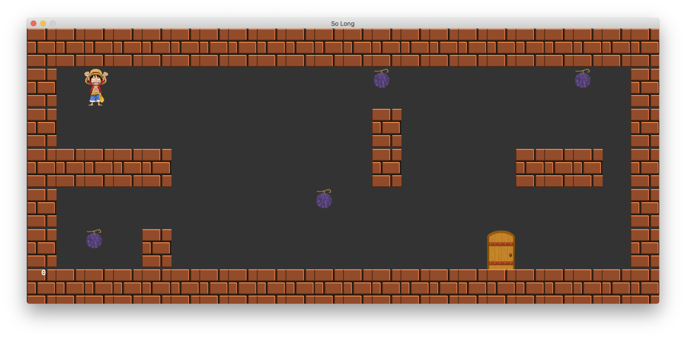

# so_long

A simple 2D tile-based game (42’s so_long) where the player collects items and reaches the exit. Built in C using MiniLibX (MLX/MLX42) and Libft.



- Entry point: src/main.c
- Core headers: include/so_long.h
- Map validator: src/check_ber.c
- Maps: map/map.ber, map/map1.ber, map/map3.ber
- Assets: assets/
- MLX: MLX/
- Libft: libraries/Libft/

## Build

- macOS (Homebrew):
  - If using MLX42, install GLFW and CMake first:

```sh
brew install glfw cmake
```

Build the project:

```sh
make
```

Clean artifacts:

```sh
make clean      # remove objects
make fclean     # remove objects + binary
make re         # full rebuild
```

## Run

```sh
./so_long map/map1.ber
```

You can use any map in the map/ folder, for example:

```sh
./so_long map/map.ber
./so_long map/map3.ber
```

Controls: WASD/Arrow keys to move; ESC quits.

## Map format

- Characters:
  - 1: wall
  - 0: floor
  - P: player (exactly one)
  - C: collectible (at least one)
  - E: exit (exactly one)
- Must be rectangular and fully walled (border = 1s).
- Must be solvable (reach all Cs and E from P).
- One map per file with .ber extension and a trailing newline.

Example (map/map1.ber):

```text
1111111111111111111111
10P000000000C000000C01
1000000000001000000001
1111100000001000011101
1000000000C00000000001
10C0100000000000E00001
1111111111111111111111
```

## Project structure

- Makefile: build rules for the game, Libft, and MLX.
- include/so_long.h: central header.
- src/check_ber.c: .ber parsing/validation.
- assets/: sprites and tiles (PNG/XPM).
- MLX/: MLX42 sources/headers/libs (or classic MiniLibX).
- libraries/Libft/: your Libft.

## Troubleshooting

- Linker errors mentioning GLFW: ensure it’s installed and linked (see build section).
- Images fail to load: confirm your loader matches asset format:
  - MLX42 prefers PNG.
  - Classic MiniLibX typically uses XPM.
